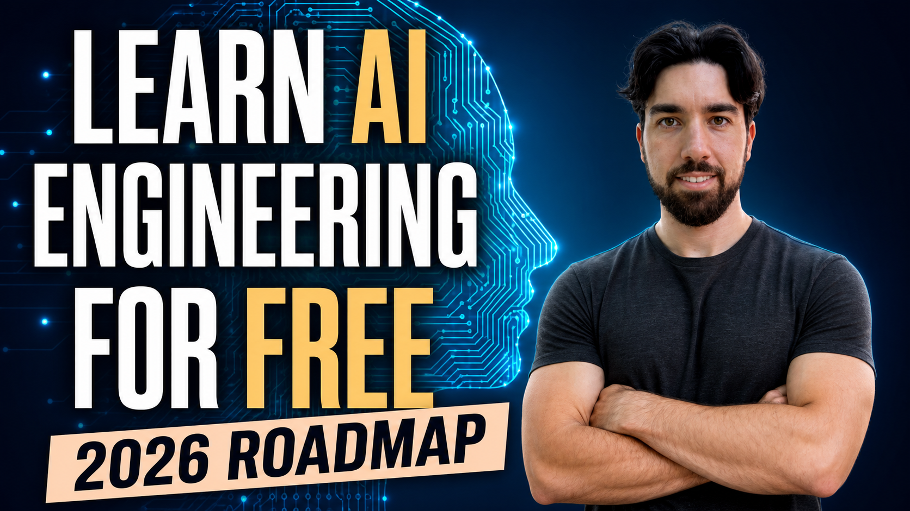

# Start AI Engineering in 2026 - Build real AI systems, mostly for free!

## A complete guide to start and improve in AI engineering in 2026 without ANY background in the field and stay up-to-date with the latest news and state-of-the-art techniques!

This guide is intended for anyone with zero or a small background in programming, AI, or machine learning who wants to become a strong AI engineer in 2026. It is organized by how you like to learn: videos, articles, books, docs, courses, and real projects.

There is no single correct order to follow, but a classic path is from top to bottom. If you dislike books, skip them. If you do not want to follow an online course, skip that too. With enough motivation, projects, and repetition, you can absolutely learn this field.

Most resources listed here are free. Paid resources are clearly labelled, and some paid course and book links are affiliate links that support this guide at no extra cost to you. Thank you, and have fun learning!

Don't be afraid to repeat videos, learn from multiple sources, and build messy projects. Repetition and debugging are where the real learning happens.

Maintainer: [louisfb01](https://github.com/louisfb01), also active on [YouTube](https://www.youtube.com/@whatsai), [the What's AI Podcast](https://www.louisbouchard.ai/podcast/), and [my personal newsletter](https://louisbouchard.substack.com/) if you want to see and hear more about AI.

[](https://x.com/Whats_AI)
[](https://www.linkedin.com/in/whats-ai/)
[](https://www.youtube.com/@WhatsAI)

***Tag Louis-François Bouchard on [X](https://x.com/Whats_AI) or [LinkedIn](https://www.linkedin.com/in/whats-ai/) if you share this guide, and feel free to suggest additions through pull requests.***

**If this guide helps you, please star the repo and share it. That is the main way other builders find it.**

### Want to know what this guide is about? Start with this video:

[](https://youtu.be/8spm9E2RsXI)

Watch [How I'd Learn AI Engineering in 2026](https://youtu.be/8spm9E2RsXI), then [subscribe to What's AI](https://www.youtube.com/c/WhatsAI?sub_confirmation=1) for more AI engineering videos.

*This guide is updated throughout 2026 as the stack moves.*

----

## Table of Contents

* [Prerequisites and learning path](#prerequisites)
* [Start with short YouTube and video introductions](#youtubevideos)
* [Books and long-form reading](#readers)
* [Online courses](#courses)
* [Practice and projects](#practice)
* [Prompting and structured outputs](#prompting)
* [Reasoning models and test-time compute](#reasoning)
* [Context engineering and long context](#context)
* [Retrieval-Augmented Generation (RAG)](#rag)
* [Embeddings, rerankers, and vector databases](#vectors)
* [Tools, MCP, and computer use](#tools)
* [Workflows, agents, and multi-agent systems](#agents)
* [Evaluations, observability, and harnesses](#evals)
* [Fine-tuning and data curation](#finetuning)
* [Multimodal and document understanding](#multimodal)
* [Voice agents and realtime AI](#voice)
* [Deployment, inference, and open-weight models](#deployment)
* [AI coding agents and developer tools](#codingagents)
* [AI safety, security, and guardrails](#aiethics)
* [Communities, subreddits, and Discords](#communities)
* [Newsletters, podcasts, and blogs](#moreresources)
* [People to follow](#peopletofollow)
* [How to find an AI engineering job](#findajob)
* [Learn more and build more with AI](#domore)

----

## Prerequisites and learning path<a name="prerequisites"></a>

Before you start collecting resources, keep the goal clear: this guide is for becoming a better AI engineer, not merely a better agentic coder.

### Quick LLM and coding-agent warning

Coding agents like Codex, Claude Code, Cursor, and similar tools can write code, scaffold apps, and speed up almost every step. You should use them. But AI engineering is the judgment layer behind the work: deciding what to build, what architecture fits, how to evaluate it, where it will fail, and whether it is reliable enough to ship.

This guide is not about outsourcing your thinking to an agent. It is about using those tools while building the foundations, taste, and decision-making ability to become a true AI engineer.

### What AI engineering means in 2026

In 2026, AI engineering goes well past prompting. You need context engineering, Retrieval-Augmented Generation (RAG), tools and the Model Context Protocol (MCP), workflow and agent design, evaluations, observability, harnesses, deployment, security, and a working understanding of reasoning models.

That is also why this guide, and our courses, prioritize learning by building. I learned AI engineering by building, and I now interview and hire AI engineers for consulting work at Towards AI, so this guide is biased toward the decision-making skills I actually look for. You can learn a lot alone with coding agents, but structure and expert feedback help you turn projects into true expertise instead of a pile of fragile demos.

### Suggested learning path

There is no single correct order. If you want a default path, I would do this:

1. Watch a few foundational videos to pick up vocabulary and intuition.
2. Pick one free course and one framework whose docs you commit to reading end to end.
3. Pick one or two books to build a solid foundation you can return to when the tools change.
4. Optionally take one or two advanced applied courses with real projects, especially if you want a structured path before breaking things on your own.
5. Build two or three small but real projects that break in interesting ways.
6. Add evaluations, tracing, and deployment before you call anything production-ready.

After that, you should have the foundations of a solid AI engineer ready for many entry-level or transition roles. Most importantly, keep learning and keep an open mind. This field changes fast, and the best engineers stay curious instead of getting religious about one model, framework, or workflow.

### Difficulty guide

Resources use compact markers from 1️⃣ to 🔟. 1️⃣ means absolute beginner, like an intro Python course; 3️⃣ is beginner-friendly AI vocabulary; 5️⃣ is practical builder material you can apply in a project; 7️⃣ is production engineering depth; 9️⃣ is advanced systems or research; and 🔟 is the kind of senior-level paper or technique you may want to revisit after you have shipped a few systems. Lower numbers first, scars later.

### Personalize this roadmap with an AI agent

You can use this guide with your favorite AI agent. Paste the prompt below into Codex, Claude Code, ChatGPT, Cursor, or another assistant, then tell it how you like to learn:

```text
Use this repo as my AI engineering roadmap: https://github.com/louisfb01/start-ai-engineering

Create a personalized learning plan for me. First ask about my background, coding level, available time, budget, preferred learning style, and goals. Then choose the most relevant resources from the repo, explain why you picked them, order them from easiest to hardest, and turn them into a weekly plan with projects, checkpoints, and what I should be able to build after each stage.
```

### If you are brand new to code

* 1️⃣ [Learn Python](https://www.learnpython.org/) - Free interactive tutorial to learn Python fundamentals if you have never touched the language.
* 1️⃣ [AI Python for Beginners](https://www.deeplearning.ai/short-courses/ai-python-for-beginners/) - DeepLearning.AI. Free short course from Andrew Ng's team, lighter on-ramp than a full bootcamp.
* 2️⃣ [Python Fundamentals + CS Concepts — A One-Stop Starter Class](https://www.youtube.com/watch?v=_uRb5wlFhyw&list=PLO4GrDnQanVfCtcyuJn6zZpwGgoNkAYFp) - Louis-François Bouchard, What's AI. Free playlist covering Python fundamentals and core computer science concepts in one place. The right starting point if you want a single resource before jumping into LLM development.
* 2️⃣ [Beginner Python for AI Engineering](https://academy.towardsai.net/courses/python-for-genai?ref=1f9b29) - Towards AI. An LLM-native Python course for people who want to go straight to building with LLMs, not through six months of classical scripting first. *(Paid, $149)*

If you already know some Python, you can jump into the rest of this guide. You do not need a mathematics PhD or deep research background. You do need basic Python, comfort reading docs, willingness to debug messy systems, and enough curiosity to build things that break. The last point matters more than people expect.

----

## Start with short YouTube and video introductions<a name="youtubevideos"></a>

Video is still the fastest way to pick up vocabulary and mental models.

### Start here for AI engineering judgment

* 4️⃣ [AI Engineering Foundations: What Developers Actually Need to Know Today](https://youtu.be/ljOwBCdiHmg) - Louis-François Bouchard. A one-hour webinar on what AI engineers need to know today: how LLMs work, their limitations, when to use prompting, RAG, workflows, or agents, and why evaluations and security matter before production.

### Foundational explainer videos

* 2️⃣ [How AI Works in Super Simple Terms](https://www.youtube.com/watch?v=q-BiW5srMFQ) - StatQuest with Josh Starmer. The gentlest possible on-ramp: how AI like ChatGPT works explained through a super simple example with no heavy math. Start here if any of the other foundational videos feel overwhelming.
* 2️⃣ [Mastering AI Jargon - Your Guide to OpenAI & LLM Terms](https://www.youtube.com/watch?v=q4G6X09NEu4) - Louis-François Bouchard. A practical glossary for the terms you keep seeing around OpenAI, GPT, LLMs, prompting, and generative AI.
* 3️⃣ [Intro to Large Language Models](https://www.youtube.com/watch?v=zjkBMFhNj_g) - Andrej Karpathy. One hour. Still the cleanest high-level tour of what an LLM is and how it works.
* 4️⃣ [AI Fundamentals for Builders - Understand transformers and fix LLM limitations](https://www.youtube.com/watch?v=R5_udqy1L4s) - Louis-François Bouchard. A builder-focused session on transformer intuition, common LLM limitations, and the techniques used to work around them.
* 5️⃣ [A Hackers' Guide to Language Models](https://www.youtube.com/watch?v=jkrNMKz9pWU) - Jeremy Howard, fast.ai. 90 minutes, practical and builder-oriented, assumes you can code.
* 6️⃣ [Deep Dive into LLMs like ChatGPT](https://www.youtube.com/watch?v=7xTGNNLPyMI) - Andrej Karpathy. 2025. Three and a half hours covering the full LLM training and inference stack, free. The single best investment if you only watch one long video this year.

### YouTube channels worth subscribing to

* 2️⃣ [StatQuest with Josh Starmer](https://www.youtube.com/@statquest) - Josh Starmer. The clearest visual explanations of ML and neural network concepts on YouTube. Ideal for building solid intuition about how transformers, attention, and training actually work before you start building.
* 3️⃣ [3Blue1Brown](https://www.youtube.com/@3blue1brown) - Grant Sanderson. Visual math and deep learning intuition. The neural networks and attention series are widely considered the best visual introductions to these concepts.
* 3️⃣ [DeepLearning.AI](https://www.youtube.com/@Deeplearningai) - Andrew Ng's official channel. Free recorded short courses on prompting, RAG, agents, evals, and more. Most of the DeepLearning.AI short courses land here first.
* 3️⃣ [IBM Technology](https://www.youtube.com/@IBMTechnology) - Clear concept explainers on LLMs, RAG, agents, and enterprise AI. Good for quickly getting up to speed on a new concept with no background noise.
* 3️⃣ [Tech With Tim](https://www.youtube.com/@TechWithTim) - Tim Ruscica. 1.89M subscribers. Beginner-to-intermediate coding and AI projects in Python. Strong for learners who want to build working things (AI games, assistants, chatbots, small ML projects) alongside the theory.
* 4️⃣ [What's AI](https://www.youtube.com/@WhatsAI) - Practical AI engineering explainers from Louis-François Bouchard. Useful for RAG, agents, MCP, evals, and learning how to reason about the stack instead of only chasing tools.
* 4️⃣ [Hugging Face](https://www.youtube.com/@HuggingFace) - Official tutorials across the open-source AI ecosystem. Covers fine-tuning, inference, datasets, and new model releases.
* 4️⃣ [Prompt Engineering](https://www.youtube.com/@engineerprompt) - Practical prompt engineering and AI/ML tutorials from a Google Developer Expert. Useful for turning prompting concepts into repeatable workflows for LLM apps.
* 5️⃣ [LangChain](https://www.youtube.com/@LangChain) - Official channel for LangChain and LangGraph. Tutorial-first videos on agents, workflows, and graph-based orchestration.
* 5️⃣ [Ray Amjad](https://www.youtube.com/@RAmjad) - Videos on agentic engineering and building with AI systems. Useful once you are ready to move from prompting into tool-using applications and coding-agent workflows.
* 5️⃣ [AI Engineer](https://www.youtube.com/@aiDotEngineer) - Talks, workshops, events, and training for AI engineers. Good for seeing what practitioners are actually building and debating.
* 5️⃣ [Jeremy Howard](https://www.youtube.com/@howardjeremyp) - fast.ai co-founder. Practical, builder-oriented, strong on software craft and AI-assisted coding.
* 5️⃣ [Two Minute Papers](https://www.youtube.com/@TwoMinutePapers) - Károly Zsolnai-Fehér. Short, enthusiastic summaries of AI research papers. Good for staying aware of what is being published without reading every paper.
* 5️⃣ [Bycloud](https://www.youtube.com/@bycloudAI) - Weekly video essays on AI news and research, aimed at builders.
* 5️⃣ [Shaw Talebi](https://www.youtube.com/@ShawhinTalebi) - Practical AI and data science tutorials from a researcher-turned-data-scientist-turned-entrepreneur. Strong for code-first ML, LLM, and portfolio-building lessons.
* 6️⃣ [Andrej Karpathy](https://www.youtube.com/@AndrejKarpathy) - Former Tesla AI and OpenAI. Best long-form explanations of how LLMs actually work — essential mental models for anyone building on top of them.
* 6️⃣ [Sam Witteveen](https://www.youtube.com/@samwitteveenai) - Deep learning, transformers, and LLM tutorials from a long-time practitioner and Google Developer Expert. Good for keeping up with applied GenAI tooling and model workflows.
* 7️⃣ [Umar Jamil](https://www.youtube.com/@umarjamilai) - Line-by-line implementations of transformers, vision-language models, and LoRA. Strong for understanding what is happening inside a model when you are debugging or fine-tuning.
* 8️⃣ [Yannic Kilcher](https://www.youtube.com/@YannicKilcher) - In-depth walkthroughs of new research papers. Essential for staying current with model releases and understanding what papers actually claim vs. what they prove.

Podcasts and longer listening are collected in the Newsletters, podcasts, and blogs section below.

----

## Books and long-form reading<a name="readers"></a>

If you prefer reading to watching, this path goes very far, especially with these books focusing on actually coding and building.

### Books worth your time

* 5️⃣ [Building LLMs for Production](https://amzn.to/4dZ0Mtz) - Towards AI. 465 pages covering prompting, RAG, fine-tuning, reliability, and shipping. Used as an internal reference manual in many companies. The [Academy e-book version](https://academy.towardsai.net/courses/buildingllmsforproduction?ref=1f9b29) is also available. *(Paid, $29 e-book)*
* 5️⃣ [Hands-On Large Language Models](https://www.oreilly.com/library/view/hands-on-large-language/9781098150952/) - Jay Alammar and Maarten Grootendorst. Visual, code-first companion that pairs well with Chip Huyen's book. *(Paid)*
* 5️⃣ [Prompt Engineering for LLMs](https://www.oreilly.com/library/view/prompt-engineering-for/9781098156145/) - John Berryman and Albert Ziegler. Written by GitHub Copilot engineers, with useful field-tested patterns. *(Paid)*
* 6️⃣ [LLM Engineer's Handbook](https://amzn.to/4x5pakJ) - Paul Iusztin and Maxime Labonne. Production-focused, built around a real end-to-end project. Pairs with the companion [code repo](https://github.com/PacktPublishing/LLM-Engineers-Handbook). *(Paid)*
* 7️⃣ [AI Engineering](https://www.oreilly.com/library/view/ai-engineering/9781098166298/) - Chip Huyen. The most-read book on O'Reilly for this space. Strong on system design, evaluation, and when each technique earns its place. *(Paid)*
* 8️⃣ [Build a Large Language Model (From Scratch)](https://www.manning.com/books/build-a-large-language-model-from-scratch) - Sebastian Raschka. Foundations and intuition. Code a GPT-style LLM from scratch in PyTorch, no libraries that hide the internals. The right book for developers who want to move past calling APIs and actually understand transformers, tokenization, attention, and fine-tuning. Pairs with the companion [LLMs-from-scratch repo](https://github.com/rasbt/LLMs-from-scratch). *(Paid)*

### Free long-form explainers that still hold up

* 4️⃣ [The Illustrated Transformer](https://jalammar.github.io/illustrated-transformer/) - Jay Alammar. The classic visual reference for the transformer architecture. Worth having open when reading about attention, tokenization, or embedding layers.
* 5️⃣ [Prompt Engineering](https://lilianweng.github.io/posts/2023-03-15-prompt-engineering/) - Lilian Weng. The cleanest overview of prompting techniques from a research perspective.
* 5️⃣ [Patterns for Building LLM-based Systems & Products](https://eugeneyan.com/writing/llm-patterns/) - Eugene Yan. Seven patterns that almost every shipped LLM product ends up using.
* 6️⃣ [The Illustrated Retrieval Transformer](https://jalammar.github.io/illustrated-retrieval-transformer/) - Jay Alammar. Useful for intuition on how retrieval-style architectures differ from pure decoder-only models.
* 7️⃣ [LLM Powered Autonomous Agents](https://lilianweng.github.io/posts/2023-06-23-agent/) - Lilian Weng, OpenAI. Still the reference post on agent design, planning, memory, and tool use.
* 7️⃣ [The State of LLMs 2025](https://magazine.sebastianraschka.com/p/state-of-llms-2025) - Sebastian Raschka's year-end synthesis of how the stack actually moved.
* 8️⃣ [Why We Think](https://lilianweng.github.io/posts/2025-05-01-thinking/) - Lilian Weng on test-time compute and why reasoning models work.

### Essential 2025-2026 articles on AI engineering

A curated short list of valuable long-form articles from 2025-2026. All are substantial reads (10+ minutes) that reward a full sitting. Topic-specific articles are in their respective sections below.

* 4️⃣ [Here's how I use LLMs to help me write code](https://simonwillison.net/2025/Mar/11/using-llms-for-code/) - Simon Willison's personal workflow, written for other practitioners. The most-shared write-up on actually working with coding agents.
* 5️⃣ [Your AI Product Needs Evals](https://hamel.dev/blog/posts/evals/) - Hamel Husain. The canonical starting point for why evals matter and how to begin.
* 6️⃣ [A Field Guide to Rapidly Improving AI Products](https://hamel.dev/blog/posts/field-guide/) - Hamel Husain. An end-to-end playbook for going from "it kinda works" to a real product. Pairs evals with error analysis and data flywheels. The single best article on *improving* an AI product once it exists.
* 6️⃣ [Building Effective AI Agents](https://www.anthropic.com/research/building-effective-agents) - Anthropic. The reference post on when to use a workflow and when autonomy actually pays its way. Widely treated as required reading.
* 6️⃣ [Harness Engineering: The Missing Layer Behind AI Agents](https://www.louisbouchard.ai/harness-engineering/) - Louis-François Bouchard. The layer between prompt engineering and a working agent: tools, permissions, state, retries, checkpoints, guardrails, and evals. Explains why harnesses, not models, separate demos from products.
* 6️⃣ [Agents](https://huyenchip.com/2025/01/07/agents.html) - Chip Huyen. A long-form primer on agent design, planning, and tool use. One of the most-shared agent posts of 2025.
* 7️⃣ [Context Engineering for LLMs: Build Reliable, Production-Ready RAG Systems](https://pub.towardsai.net/context-engineering-4a17018c41cf) - A full walkthrough of chunking, hybrid retrieval (BM25 + dense), reranking, and token budgeting. Practical enough to take a RAG prototype to production.
* 7️⃣ [Effective harnesses for long-running agents](https://www.anthropic.com/engineering/effective-harnesses-for-long-running-agents) - Anthropic. Scaffolding for hour-long agent runs: checkpoints, state, and recovery patterns.
* 7️⃣ [Agent Observability and Evaluation: A 2026 Developer's Guide](https://pub.towardsai.net/agent-observability-and-evaluation-a-2026-developers-guide-to-building-reliable-ai-agents-f4547e4beb14) - Divy Yadav's long-form piece on why most teams still have no evals, what to instrument first, and how to close the feedback loop between traces and fixes.
* 7️⃣ [12-Factor Agents](https://github.com/humanlayer/12-factor-agents) - Dex Horthy. Widely-cited production-agent checklist covering state, tools, context, and reliability. Referenced across most 2025-2026 agent engineering discussions.
* 7️⃣ [Systematically Improving RAG](https://jxnl.co/writing/2024/05/22/systematically-improving-your-rag/) - Jason Liu. A disciplined iteration playbook for RAG, from evals to metadata to user feedback loops. Still the reference piece for RAG consultants.
* 8️⃣ [How we built our multi-agent research system](https://www.anthropic.com/engineering/built-multi-agent-research-system) - Anthropic. Real architecture behind a shipped multi-agent product, including the tradeoffs and failure modes you only see in production.
* 8️⃣ [The Lethal Trifecta for AI Agents](https://simonwillison.net/2025/Jun/16/the-lethal-trifecta/) - Simon Willison. Private data, untrusted content, and external communication — the combination every agent builder needs to internalize before shipping.
* 8️⃣ [How to Fine-Tune LLMs in 2025 with Hugging Face](https://www.philschmid.de/fine-tune-llms-in-2025) - Philipp Schmid. The single best recent how-to on modern fine-tuning.

Articles from Anthropic, OpenAI, and individual practitioners (Shreya Shankar, Paul Iusztin, and others) are also referenced in the topic-specific sections below. Start with the topic you care about most and work outward.

For ongoing reading, rotate between practitioner blogs, official engineering posts, the [Towards AI publication on Medium](https://pub.towardsai.net/), and the [Towards AI Newsletter](https://newsletter.towardsai.net/) instead of relying on one source.

### A reading loop that actually works

A common mistake is reading ten articles on the same topic and building nothing. A better loop is: read one conceptual article, read one official docs page, build one tiny version yourself, then reread the article once you have scars. The second pass hits very differently.

----

## Online courses<a name="courses"></a>

If you want more structure, courses are the fastest route through this material.

### Deep, end-to-end programs

* 2️⃣ [AI for Work](https://academy.towardsai.net/courses/ai-business-professionals?ref=1f9b29) - Towards AI. 15 modules for non-developers who want to actually use AI at work. No coding required. *(Paid, $399)*
* 3️⃣ [10-Hour LLM Fundamentals](https://academy.towardsai.net/courses/llm-primer?ref=1f9b29) - Towards AI. Compact video-first crash course covering when to use prompting, RAG, fine-tuning, or agents. Useful before going deep. *(Paid, $199)*
* 5️⃣ [Full Stack AI Engineering](https://academy.towardsai.net/courses/beginner-to-advanced-llm-dev?ref=1f9b29) - Towards AI's flagship program. 90+ lessons across prompting, RAG, fine-tuning, tools, agents, and deployment, built around one production capstone. Designed for people who want a full developer path to AI engineering. *(Paid, $349)*
* 7️⃣ [Agentic AI Engineering](https://academy.towardsai.net/courses/agent-engineering?ref=1f9b29) - Towards AI. 34 lessons and two production agents (a research agent and a writing workflow), covering context engineering, evaluations, observability, containers, and deployment. For people who already ship LLM apps and want to specialize. *(Paid, $499)*

### Free docs-heavy paths

* 4️⃣ [Hugging Face LLM Course](https://huggingface.co/learn/llm-course/chapter1/1) - Free. The best free structured path through tokenization, fine-tuning, and modern transformers.
* 4️⃣ [Anthropic Academy](https://www.anthropic.com/learn) - Free. Includes an [Introduction to MCP](https://anthropic.skilljar.com/introduction-to-model-context-protocol).
* 5️⃣ [Hugging Face Agents Course](https://huggingface.co/learn/agents-course/) - Free. Walks through agents, tools, and orchestration using open-source models.
* 5️⃣ [Hugging Face MCP Course](https://huggingface.co/learn/mcp-course/) - Free. Builds both client and server sides of MCP from scratch.
* 5️⃣ [LangChain Academy](https://academy.langchain.com/) - Free. The official path through LangChain and LangGraph.

### Useful DeepLearning.AI short courses (free)

* 3️⃣ [ChatGPT Prompt Engineering for Developers](https://www.deeplearning.ai/short-courses/chatgpt-prompt-engineering-for-developers/) - Andrew Ng and Isa Fulford. Free. The prompting short course most teams already assume you have done.
* 4️⃣ [Building Systems with the ChatGPT API](https://www.deeplearning.ai/short-courses/building-systems-with-chatgpt/) - Free. Multi-step chains, moderation, and evals at a beginner level.
* 5️⃣ [Improving Accuracy of LLM Applications](https://www.deeplearning.ai/short-courses/improving-accuracy-of-llm-applications/) - Free. Practical methods for moving from 70% to 95% accuracy.
* 6️⃣ [Agent Skills with Anthropic](https://www.deeplearning.ai/short-courses/agent-skills-with-anthropic/) - Free. Agent skills, the Anthropic way.
* 6️⃣ [Agent Memory: Building Memory-Aware Agents](https://www.deeplearning.ai/short-courses/agent-memory-building-memory-aware-agents/) - Free. Short, focused course on memory architectures.
* 6️⃣ [A2A: The Agent2Agent Protocol](https://www.deeplearning.ai/short-courses/a2a-the-agent2agent-protocol/) - Free. Google's Agent2Agent protocol explained by its designers.
* 6️⃣ [Semantic Caching for AI Agents](https://www.deeplearning.ai/short-courses/semantic-caching-for-ai-agents/) - Free. Cutting cost and latency through caching strategies.
* 6️⃣ [NVIDIA NeMo Agent Toolkit: Making Agents Reliable](https://www.deeplearning.ai/short-courses/nvidia-nat-making-agents-reliable/) - Free. Guardrails and reliability at scale.
* 6️⃣ [Building Coding Agents with Tool Execution](https://www.deeplearning.ai/short-courses/building-coding-agents-with-tool-execution/) - Free. The core loop behind modern coding agents.

Several DeepLearning.AI courses are listed in the topic sections below instead of here: `AI Agents in LangGraph` (under Agents), `Automated Testing for LLMOps` (under Evaluations), `Red Teaming LLM Applications` (under AI Safety), `Efficient Inference with SGLang` (under Deployment), and `Document AI: From OCR to Agentic Doc Extraction` (under Multimodal).

### Which course to pick from the Towards AI offerings

* 2️⃣ No Python yet: [Beginner Python for AI Engineering](https://academy.towardsai.net/courses/python-for-genai?ref=1f9b29) first.
* 2️⃣ Non-technical and want to use AI at work: [AI for Work](https://academy.towardsai.net/courses/ai-business-professionals?ref=1f9b29).
* 3️⃣ Want a quick overview first: start with [10-Hour LLM Fundamentals](https://academy.towardsai.net/courses/llm-primer?ref=1f9b29).
* 4️⃣ Want the whole stack from nothing: start with the [Get it all! From Novice to Expert Bundle](https://academy.towardsai.net/bundles/get-it-all?ref=1f9b29).
* 5️⃣ Python-comfortable and want the full developer path: start with [Full Stack AI Engineering](https://academy.towardsai.net/courses/beginner-to-advanced-llm-dev?ref=1f9b29).
* 5️⃣ Want free and docs-heavy: pair the [Hugging Face LLM Course](https://huggingface.co/learn/llm-course/chapter1/1) with [LangChain Academy](https://academy.langchain.com/).
* 7️⃣ Already shipped basic LLM apps and want to specialize: go to [Agentic AI Engineering](https://academy.towardsai.net/courses/agent-engineering?ref=1f9b29).

----

## Practice and projects<a name="practice"></a>

Reading and watching will only take you so far. You become an AI engineer by building systems that fail in expensive and educational ways.

[](https://youtu.be/D89pj9cqUm4)

Watch [What I Look For When Hiring AI Engineers](https://youtu.be/D89pj9cqUm4) before you start your first serious project. I share how I evaluate AI engineering candidates, why decision-making matters more than polished agent-generated output, and what kinds of practice projects actually teach useful skills.

### Good first projects

* 4️⃣ A document question-answering assistant with citations and a real eval set.
* 4️⃣ A customer support workflow with tools and structured outputs.
* 5️⃣ A research assistant that plans, searches, reads, and writes a short brief.
* 5️⃣ A coding helper scoped to one narrow internal task.
* 5️⃣ A multimodal invoice or receipt parser with validation.
* 6️⃣ [Designing Real-World AI Agents Workshop](https://github.com/iusztinpaul/designing-real-world-ai-agents-workshop) - Paul Iusztin's hands-on workshop for building a Deep Research Agent plus a LinkedIn Writing Workflow as MCP servers. It includes code, slides, video, evaluation patterns, and an `implement_yourself/` path designed to be rebuilt with agentic coding tools instead of copied.
* 6️⃣ A small agent that plans, acts, checks, and retries within a budget.

### Reference repos and tutorials

* 3️⃣ [OpenAI Cookbook](https://github.com/openai/openai-cookbook) - Official recipes in notebook form. The quickest path to a working example of most common tasks.
* 4️⃣ [Google Gemini Cookbook](https://github.com/google-gemini/cookbook) - Google. Gemini-flavored equivalent covering multimodal, long context, and tool use.
* 4️⃣ [LlamaIndex Starter Tutorial](https://developers.llamaindex.ai/python/framework/getting_started/starter_example/) and [Understanding LlamaIndex](https://developers.llamaindex.ai/python/framework/understanding/) - The fastest path from zero to a working RAG pipeline.
* 4️⃣ [AI Engineering Cheatsheets](https://github.com/louisfb01/ai-engineering-cheatsheets) - Louis-François Bouchard's decision tables and playbooks for choosing approaches.
* 5️⃣ [Pydantic AI docs](https://ai.pydantic.dev/) - Type-safe agent framework from the Pydantic team.
* 6️⃣ [DSPy Tutorials](https://dspy.ai/tutorials/) - Tutorials for the DSPy approach of compiling prompts as programs.
* 6️⃣ [Designing Real-World AI Agents Workshop](https://github.com/iusztinpaul/designing-real-world-ai-agents-workshop) - Build and run a multi-agent system with MCP servers, evaluator-optimizer loops, grounded search, structured outputs, and LLM-as-judge evaluation.
* 7️⃣ [Paul Iusztin's hands-on-llms repo](https://github.com/iusztinpaul/hands-on-llms) - End-to-end production project with training, serving, and monitoring.

Framework docs for agent-oriented libraries (LangGraph, CrewAI, AutoGen, Agno) live in the Agents section below.

### Questions to force yourself to answer on every project

* Why is this prompt, tool, or architecture chosen?
* Where and how will it fail?
* How will I evaluate it, offline and online?
* What will I log and inspect when it misbehaves?
* What is the cheapest design that still clears the bar?
* Is an agent actually the right choice here, or is a workflow enough?

If you cannot answer those, keep building.

----

## Prompting and structured outputs<a name="prompting"></a>

Prompting still matters in 2026. The useful version is not clever tricks. It is writing reliable contracts for non-deterministic systems.

### Subtopics to cover

Clear task framing, output contracts, structured outputs and JSON schemas, few-shot examples, grounding and citations, verification loops, tool-use instructions, completion criteria, and prompt versioning.

### Best resources

* 3️⃣ [OpenAI Prompt Engineering Guide](https://platform.openai.com/docs/guides/prompt-engineering) - Official, up-to-date, API-centric.
* 3️⃣ [Anthropic Prompt Engineering Overview](https://docs.anthropic.com/en/docs/build-with-claude/prompt-engineering/overview) - Claude-specific advice, generalizes well.
* 3️⃣ [Anthropic Prompt Library](https://docs.anthropic.com/en/prompt-library/library) - Anthropic's curated library of battle-tested prompts.
* 3️⃣ [Learn Prompting](https://learnprompting.org/) - Free, community-maintained reference covering beginner to advanced prompting.
* 5️⃣ [OpenAI GPT-5 Prompting Guide](https://cookbook.openai.com/examples/gpt-5/gpt-5_prompting_guide) - Model-specific prompting advice from the OpenAI team.
* 5️⃣ [Anthropic: Increase Output Consistency](https://docs.anthropic.com/en/docs/test-and-evaluate/strengthen-guardrails/increase-consistency) - Techniques for reducing output drift across runs.
* 5️⃣ [Instructor: structured outputs with Pydantic](https://python.useinstructor.com/) - Jason Liu's library for turning free-form LLM outputs into typed Python objects.
* 6️⃣ [Structured Data Extraction from Unstructured Content Using LLM Schemas](https://simonwillison.net/2025/Feb/28/llm-schemas/) - Simon Willison's approach to schema-first extraction.

Treat prompts as code you version, interfaces you test, and product decisions you revisit. That framing is more useful than any list of prompting tricks.

----

## Reasoning models and test-time compute<a name="reasoning"></a>

Reasoning models (OpenAI o-series, Anthropic Claude with extended thinking, Google Gemini Pro with thinking, DeepSeek R-models, Qwen reasoning variants) behave differently from standard chat models. They reward different prompting and break in different ways.

### Subtopics to cover

When reasoning models help, when they hurt, how to set thinking budgets, how to structure input for a thinking model, extended thinking and tool use together, and cost/latency tradeoffs.

### Best resources

* 4️⃣ [Towards AI Newsletter issues](https://newsletter.towardsai.net/) - Weekly coverage of major reasoning model releases with benchmarks and opinion.
* 5️⃣ [Anthropic: Prompt caching](https://docs.anthropic.com/en/docs/build-with-claude/prompt-caching) - Usually where reasoning costs get controlled in production.
* 6️⃣ [Anthropic: Building with extended thinking](https://docs.anthropic.com/en/docs/build-with-claude/extended-thinking) - Official docs on how to use Claude's thinking mode correctly.
* 7️⃣ [OpenAI: Run long horizon tasks with Codex](https://developers.openai.com/blog/run-long-horizon-tasks-with-codex) - Long-running reasoning workflows in practice.
* 7️⃣ [OpenAI: Unrolling the Codex agent loop](https://openai.com/index/unrolling-the-codex-agent-loop/) - Inside the loop that a reasoning agent actually runs.
* 7️⃣ [The State of LLMs 2025](https://magazine.sebastianraschka.com/p/state-of-llms-2025) - Sebastian Raschka's overview of how reasoning models reshaped the stack.
* 8️⃣ [Why We Think](https://lilianweng.github.io/posts/2025-05-01-thinking/) - Lilian Weng on the theory behind test-time compute.

Rule of thumb for 2026: reach for a reasoning model when the task genuinely requires multi-step planning, verification, or tool use. For simple classification, extraction, or short answers, a cheaper standard model still wins on cost and latency.

----

## Context engineering and long context<a name="context"></a>

Context engineering is one of the most important 2026 skills. The model is only as good as what you put in its context and how you stage it.

### Subtopics to cover

What belongs in context and what does not, context windows and context rot, message history management, memory versus retrieval, compaction and summaries, working files and scratchpads, repo-level instructions such as AGENTS.md or CLAUDE.md, and context handoffs between runs.

### Best resources

* 4️⃣ [Anthropic: Context windows](https://docs.anthropic.com/en/docs/build-with-claude/context-windows) - Official docs with practical guidance on context limits and caching.
* 5️⃣ [Context engineering](https://simonwillison.net/2025/Jun/27/context-engineering/) and [How to Fix Your Context](https://simonwillison.net/2025/Jun/29/how-to-fix-your-context/) - Simon Willison. The two posts that gave the field its current vocabulary.
* 5️⃣ [Lost in the Middle](https://pub.towardsai.net/lost-in-the-middle-629b20d86152) - How attention drops inside long contexts and what it means for your prompt design.
* 6️⃣ [Effective context engineering for AI agents](https://www.anthropic.com/engineering/effective-context-engineering-for-ai-agents) - Anthropic. How the Claude team thinks about context as a first-class design surface.
* 6️⃣ [Harness Engineering](https://www.louisbouchard.ai/harness-engineering/) - Louis-François Bouchard on the scaffolding around the model that controls what enters and leaves context.
* 7️⃣ [Context engineering for LLMs: Production-Ready RAG Systems](https://pub.towardsai.net/context-engineering-4a17018c41cf) - Chunking, retrieval, reranking, and token budgeting for real systems.
* 7️⃣ [Jason Liu's Context Engineering Series](https://jxnl.co/writing/2025/08/28/context-engineering-index/) - Consulting-flavored write-up from enterprise projects.

Most people try to fix bad systems by stuffing more tokens into the prompt. That usually makes results worse. The better habit is to be intentional about which instructions are permanent, which data is retrieved on demand, which state gets externalized into files or tools, and when to reset the context entirely.

----

## Retrieval-Augmented Generation (RAG)<a name="rag"></a>

RAG is still a core technique. The naive "stuff some chunks into the prompt" version is no longer enough.

### Subtopics to cover

Chunking strategies, embeddings, vector search, hybrid search with BM25, reranking, citations and provenance, metadata filtering, query rewriting, corrective RAG, retrieval quality evaluation, agentic retrieval, and knowing when RAG is the wrong answer.

### Best resources

* 4️⃣ [Why RAG Is Not Training Your AI](https://www.louisbouchard.ai/why-rag-is-not-training-your-ai/) - Louis-François Bouchard on the mental model most builders get wrong.
* 4️⃣ [LlamaIndex Introduction to RAG](https://developers.llamaindex.ai/python/framework/understanding/rag/) - Official docs. The cleanest free path to a working RAG system.
* 4️⃣ [Pinecone RAG guide](https://www.pinecone.io/learn/retrieval-augmented-generation/) - Vendor-written but solid introduction with diagrams.
* 5️⃣ [Is RAG Still Needed in the Era of Long Context LLMs?](https://pub.towardsai.net/is-rag-still-needed-in-the-era-of-long-context-llms-3d89907ce624) - Clear framework for when long context replaces RAG and when it does not.
* 6️⃣ [Contextual Retrieval in AI Systems](https://www.anthropic.com/news/contextual-retrieval) - Anthropic's prompt-cached contextual chunking pattern with measured quality gains.
* 6️⃣ [Hybrid Search RAG That Actually Works](https://pub.towardsai.net/hybrid-search-rag-that-actually-works-bm25-vectors-reranking-in-python-0c02ade0799d) - Production-ready code combining BM25, vectors, and reranking.
* 7️⃣ [Context Engineering, Not Retrieval: Why Your Agentic RAG Fails in Production](https://pub.towardsai.net/context-engineering-not-retrieval-why-your-agentic-rag-fails-in-production-39093f0e5025) - April 2026. The gap between prototype and production is almost always a context problem, not a retrieval problem. Practical diagnosis for teams that have tuned embeddings for months and still see failures.
* 7️⃣ [Why Most RAGs Stay POCs — How to Take Your Data Pipelines to Production](https://pub.towardsai.net/why-most-rags-stay-pocs-how-to-take-your-data-pipelines-to-production-4ac01fe9f9e3) - Why prototype RAG systems stall before production, and how to structure data pipelines (Databricks Asset Bundles, Python Wheel artifacts, Clean Architecture) so they actually ship and stay maintainable.
* 7️⃣ [Vectorless RAG: Your RAG Pipeline Doesn't Need a Vector Database](https://pub.towardsai.net/vectorless-rag-your-rag-pipeline-doesnt-need-a-vector-database-0a0839feabd9) - For structured documents like contracts and financial reports, building a hierarchical JSON tree and letting the LLM navigate it can beat embeddings-plus-vector-DB. No chunking, no vector DB, fully traceable citations.
* 7️⃣ [Systematically Improving RAG](https://jxnl.co/writing/2024/05/22/systematically-improving-your-rag/) - Jason Liu's playbook for RAG iteration.
* 8️⃣ [Evolve or perish: The new RAG paradigm](https://www.decodingai.com/p/evolve-or-perish-the-new-rag-paradigm) - Paul Iusztin on where RAG is heading.

Do not stop at "uploaded PDF, got answer." Build one serious RAG app with citations, retrieval debugging, considered chunking choices, metadata filters, an eval set, and a way to inspect misses. That is where the real learning happens.

----

## Embeddings, rerankers, and vector databases<a name="vectors"></a>

Good retrieval depends on the pieces around the model.

### Embedding models and rerankers

* 4️⃣ [Cohere Embed and Rerank](https://docs.cohere.com/docs/embeddings) - Strong general-purpose production choice with multilingual support.
* 4️⃣ [Voyage AI](https://docs.voyageai.com/) - Domain-specific embeddings (finance, legal, medical) plus the `rerank-2` reranker.
* 4️⃣ [Jina Embeddings](https://jina.ai/embeddings/) and [Jina Reranker](https://jina.ai/reranker) - Competitive multilingual options, strong on long documents.
* 4️⃣ [Nomic Embed](https://home.nomic.ai/embed) - Strong open-source option with Apache 2.0 licensing.
* 5️⃣ [Hugging Face MTEB Leaderboard](https://huggingface.co/spaces/mteb/leaderboard) - Community leaderboard for picking an embedding model by task.

### Vector databases

* 4️⃣ [Qdrant docs](https://qdrant.tech/documentation/) - Fast, production-ready, open source, free managed tier.
* 4️⃣ [Weaviate docs](https://weaviate.io/developers/weaviate) - Open source with built-in hybrid search and RAG modules.
* 4️⃣ [LanceDB docs](https://lancedb.github.io/lancedb/) - Embedded, Python-first, no server needed. Great for local RAG prototypes.
* 4️⃣ [Pinecone](https://docs.pinecone.io/) - Managed serverless, the most common enterprise default.
* 4️⃣ [pgvector](https://github.com/pgvector/pgvector) - Vector search inside Postgres. Best choice when you already have Postgres and want to avoid a second system.
* 4️⃣ [Chroma](https://docs.trychroma.com/) - Light, simple, good for prototypes and tutorials.

### Good practitioner write-ups

* 7️⃣ [Inside Vector Databases: Engineering High-Dimensional Search](https://pub.towardsai.net/inside-vector-databases-engineering-high-dimensional-search-for-modern-ai-systems-704c2efe99e9) - How HNSW and IVF actually work.

----

## Tools, MCP, and computer use<a name="tools"></a>

If prompting was the first phase of AI apps, and tools the second, then in 2026 MCP and structured tool ecosystems are part of the default stack.

### Subtopics to cover

Function and tool calling, tool schemas, tool selection and retries, permissions and safety boundaries, tool result formatting, MCP clients and servers, web search and code execution tools, computer use, and authentication against external systems.

### Best resources

* 5️⃣ [Anthropic Tool use overview](https://docs.anthropic.com/en/docs/build-with-claude/tool-use/overview) - The cleanest reference for function calling with Claude.
* 5️⃣ [Introducing the Model Context Protocol](https://www.anthropic.com/news/model-context-protocol) - Original announcement, still the best one-page summary.
* 5️⃣ [Model Context Protocol Getting Started](https://modelcontextprotocol.io/docs/getting-started/intro) - Official MCP docs.
* 5️⃣ [Hugging Face MCP Course](https://huggingface.co/learn/mcp-course/) - Free course covering the client and server implementation.
* 5️⃣ [Introduction to Model Context Protocol](https://anthropic.skilljar.com/introduction-to-model-context-protocol) - Anthropic's own short course, free.
* 6️⃣ [Anthropic Web search tool](https://docs.anthropic.com/en/docs/build-with-claude/tool-use/web-search-tool) and [Code execution tool](https://docs.anthropic.com/en/docs/agents-and-tools/tool-use/code-execution-tool) - Built-in tools that remove most of the glue you used to write.
* 6️⃣ [Anthropic Skills](https://www.anthropic.com/engineering/equipping-agents-for-the-real-world-with-agent-skills) and [Agent Skills open standard](https://agentskills.io/) - The skills primitive: reusable markdown instructions Claude loads at the right moment. First-class in Claude.ai, Claude Code, and the API in 2026, now an open standard used across multiple agent platforms.
* 6️⃣ [Anthropic Computer use](https://docs.anthropic.com/en/docs/build-with-claude/computer-use) - Letting a model control a screen and a keyboard inside sandboxed environments.
* 6️⃣ [MCP Architecture overview](https://modelcontextprotocol.io/docs/learn/architecture), [Server concepts](https://modelcontextprotocol.io/docs/learn/server-concepts), [Build an MCP server](https://modelcontextprotocol.io/docs/develop/build-server), and [Build an MCP client](https://modelcontextprotocol.io/docs/develop/build-client) - Full reference for both sides of the protocol.
* 7️⃣ [Writing effective tools for agents](https://www.anthropic.com/engineering/writing-tools-for-agents) - Anthropic. Practical guide to tool schemas, descriptions, and error handling.
* 7️⃣ [Code execution with MCP](https://www.anthropic.com/engineering/code-execution-with-mcp) - Anthropic's pattern for composing MCP servers through code instead of long tool lists.
* 7️⃣ [Model Context Protocol (MCP): Why Every AI Developer Needs MCP in 2026](https://pub.towardsai.net/model-context-protocol-mcp-why-every-ai-developer-needs-mcp-in-2026-e68d39a49417) - Why MCP replaces ad-hoc REST integrations: decoupled Host/Client/Server architecture, why it scales better than direct API wiring, and what it means for maintaining AI applications across provider changes.
* 8️⃣ [Model Context Protocol has Prompt Injection Security Problems](https://simonwillison.net/2025/Apr/9/mcp-prompt-injection/) - Simon Willison. Read this before you deploy an MCP server that touches private data.

### Search APIs worth knowing

Agents that need to search the web rarely call raw Google or Bing. These are the APIs most production stacks use:

* 4️⃣ [Tavily](https://docs.tavily.com/) - Purpose-built search API for LLM agents with content extraction and summarization.
* 4️⃣ [Exa](https://docs.exa.ai/) - Semantic search API with neural retrieval over the web.
* 4️⃣ [Brave Search API](https://brave.com/search/api/) - Privacy-focused web search, common choice for agent stacks that need independent indexing.

The model is not your system. The tool layer is where most real capability and most real risk both live.

----

## Workflows, agents, and multi-agent systems<a name="agents"></a>

This is where hype gets loud and engineering judgment becomes valuable.

### Subtopics to cover

Workflow versus agent, single agent versus multi-agent, ReAct and tool loops, routing and orchestration, planning and reflection, human-in-the-loop, state and memory, failure modes, and when to avoid autonomy altogether.

### Best resources

* 5️⃣ [AI Agents in LangGraph](https://www.deeplearning.ai/short-courses/ai-agents-in-langgraph/) - Harrison Chase and DeepLearning.AI. Free. The cleanest intro to graph-based agents.
* 5️⃣ [LangGraph docs](https://docs.langchain.com/oss/python/langgraph/overview) - Official graph-based orchestration docs for long-running, stateful agents.
* 5️⃣ [LlamaIndex Workflows](https://developers.llamaindex.ai/python/llamaagents/workflows/) - LlamaIndex's event-driven workflow system.
* 5️⃣ [CrewAI](https://docs.crewai.com/), [AutoGen](https://microsoft.github.io/autogen/stable/), and [Agno](https://docs.agno.com/) - Framework docs for three of the main alternatives.
* 6️⃣ [Building Effective AI Agents](https://www.anthropic.com/research/building-effective-agents) - Anthropic. The reference post on agent vs workflow design.
* 6️⃣ [Stop Building Agent Demos](https://www.louisbouchard.ai/stop-building-agent-demos/) - Louis-François Bouchard on the demo-to-production gap.
* 6️⃣ [Agents and Workflows](https://www.louisbouchard.ai/agents-and-workflows/) - Louis-François Bouchard on when multi-agent is overengineering.
* 6️⃣ [What Makes an AI Agent Actually Agentic?](https://pub.towardsai.net/what-makes-an-ai-agent-actually-agentic-building-beyond-the-basics-with-langgraph-cf73c659d753) - What separates a real agent from a workflow wearing an LLM hat: autonomy, memory, and resilience. Walks through refactoring a hardcoded LangGraph assistant into a ReAct-based agent with SQLite checkpointing and layered, context-aware error handling.
* 6️⃣ [Agent Architecture Guide](https://github.com/louisfb01/ai-engineering-cheatsheets/blob/main/Agent_Architecture_Guide.md) - Louis-François Bouchard's 13-question decision framework for agent design.
* 7️⃣ [LLM Powered Autonomous Agents](https://lilianweng.github.io/posts/2023-06-23-agent/) - Lilian Weng. The reference post that defined the field.
* 7️⃣ [Agents](https://huyenchip.com/2025/01/07/agents.html) - Chip Huyen's long-form primer on agent design, planning, and tool use. One of the most-shared agent posts of 2025.
* 7️⃣ [12-Factor Agents](https://github.com/humanlayer/12-factor-agents) - Dex Horthy's widely-cited production-agent checklist covering state, tools, context, and reliability. Heavily referenced across 2025-2026 agent engineering discussions.
* 7️⃣ [Creating an Advanced AI Agent From Scratch with Python in 2026](https://pub.towardsai.net/creating-an-advanced-ai-agent-from-scratch-with-python-in-2026-part-1-ce74a23f6514) - Modular architecture over framework lock-in: a flexible tool system, provider-agnostic LLM wrapper, and a ReAct-based agent orchestrator with Pydantic for type-safe tool execution. Lets you swap models and tools without touching the core loop.
* 7️⃣ [The Two Things Every Reliable Agent Needs](https://pub.towardsai.net/the-two-things-every-reliable-agent-needs-ec3c2621cce7) - A framework centered on memory-first design and an anti-Goodhart scoreboard: treat memory as a core system with defined forms, functions, and dynamics, and evaluate with adversarial metrics across full episodes so agents solve the actual problem instead of gaming a proxy.
* 7️⃣ [LangChain Middleware: The Missing Layer Between Your Agent and Production](https://pub.towardsai.net/langchain-middleware-the-missing-layer-between-your-agent-and-production-b7a5b8cba4c2) - LangChain's new middleware system pulls operational concerns (summarization, human approval, retries, token tracking, dynamic routing, tool monitoring, context injection) out of agent logic and into a dedicated layer. Covers decorator vs class-style hooks, ordering rules, custom state schemas, and five production patterns.
* 7️⃣ [Google's A2A Protocol using LangGraph: Build Agent Systems That Actually Communicate](https://pub.towardsai.net/googles-a2a-protocol-using-langgraph-build-agent-systems-that-actually-communicate-2b8ee488f808) - Divy Yadav. Practical deep-dive into Agent2Agent: Agent Cards for discovery, structured task lifecycles, HTTP messaging, and how A2A complements (not competes with) MCP. Covers real production failure modes — timeout handling, context mismatch, authentication drift — with a LangGraph implementation walkthrough.
* 7️⃣ [Agentic AI Engineering](https://academy.towardsai.net/courses/agent-engineering?ref=1f9b29) - Towards AI's deep dive with two shipped agents as capstones. *(Paid)*
* 8️⃣ [How we built our multi-agent research system](https://www.anthropic.com/engineering/built-multi-agent-research-system) - Anthropic. Real architecture behind a shipped multi-agent product.
* 8️⃣ [Building Production Text-to-SQL for 70,000+ Tables: OpenAI's Data Agent Architecture](https://pub.towardsai.net/building-production-text-to-sql-for-70-000-tables-openais-data-agent-architecture-bcd695990d55) - How OpenAI built an internal data agent for its own data warehouse. Goes beyond naive query generation: six layers of context (table usage patterns, human annotations, business logic extracted from code), plus a closed-loop validation step where the agent profiles results, catches its own errors, and repairs queries. The real lesson — agent effectiveness depends on the richness of context, not the model.

Most teams should start with a workflow. Add autonomy only where it clearly buys something. That saves token spend, latency, debugging pain, and a lot of regret.

----

## Evaluations, observability, and harnesses<a name="evals"></a>

The layer most people skip and rediscover the hard way.

### Subtopics to cover

Golden datasets, rule-based checks, LLM-as-a-judge, regression testing, traces and spans, prompt versioning, error analysis, offline evaluations and online monitoring, harness design, and testability of agent behavior.

### Best resources

* 5️⃣ [Your job is to deliver code you have proven to work](https://simonwillison.net/2025/Dec/18/code-proven-to-work/) - Simon Willison. Less about tooling, more about the right mental model for this work.
* 5️⃣ [Your AI Product Needs Evals](https://hamel.dev/blog/posts/evals/) and [LLM Evals FAQ](https://hamel.dev/blog/posts/evals-faq/) - Hamel Husain. The canonical starting point.
* 5️⃣ [Automated Testing for LLMOps](https://www.deeplearning.ai/short-courses/automated-testing-llmops/) - DeepLearning.AI short course, free. CI-style testing for LLM-powered apps.
* 5️⃣ [Ragas](https://docs.ragas.io/en/stable/) - Open-source RAG evaluation library.
* 5️⃣ [LangSmith](https://docs.langchain.com/langsmith/home) and [LangSmith Evaluation](https://docs.langchain.com/langsmith/evaluation) - Hosted tracing and eval tooling from LangChain.
* 5️⃣ [Braintrust](https://www.braintrust.dev/docs/start) - Commercial eval and observability platform popular with teams that want structured experiment tracking.
* 5️⃣ [Arize Phoenix](https://arize.com/docs/phoenix) - Open-source observability for LLM applications.
* 5️⃣ [Pydantic AI and Logfire](https://logfire.pydantic.dev/docs/) - Type-safe agent framework and observability tool from the Pydantic team.
* 6️⃣ [Harness Engineering: The Missing Layer Behind AI Agents](https://www.louisbouchard.ai/harness-engineering/) - Louis-François Bouchard on why harnesses, not models, are what separates production from prototype.
* 6️⃣ [Harness engineering](https://openai.com/index/harness-engineering/) - OpenAI's framing of the same layer for coding agents.
* 6️⃣ [Testing Agent Skills Systematically with Evals](https://developers.openai.com/blog/eval-skills) - OpenAI on building evals for agent skills.
* 6️⃣ [Effective harnesses for long-running agents](https://www.anthropic.com/engineering/effective-harnesses-for-long-running-agents) - Anthropic. Scaffolding for hour-long agent runs.
* 6️⃣ [A Field Guide to Rapidly Improving AI Products](https://hamel.dev/blog/posts/field-guide/) - Hamel Husain's end-to-end playbook for going from "it kinda works" to a real product, pairing evals with error analysis and data flywheels.
* 6️⃣ [Task-Specific LLM Evals that Do & Don't Work](https://eugeneyan.com/writing/evals/) and [Evaluating LLM-Evaluators](https://eugeneyan.com/writing/llm-evaluators/) - Eugene Yan on where LLM-as-judge helps and where it misleads.
* 6️⃣ [In Defense of AI Evals, for Everyone](https://www.sh-reya.com/blog/in-defense-ai-evals/) and [Data Flywheels for LLM Applications](https://www.sh-reya.com/blog/ai-engineering-flywheel/) - Shreya Shankar on why evals are a product skill, not a research skill.
* 7️⃣ [Agent Observability and Evaluation: A 2026 Developer's Guide](https://pub.towardsai.net/agent-observability-and-evaluation-a-2026-developers-guide-to-building-reliable-ai-agents-f4547e4beb14) - Divy Yadav. One of the most complete recent write-ups.
* 7️⃣ [MLflow Observability for Generative AI: A Deep Dive with Text2SQL + RAG + WebSearch using LangGraph](https://pub.towardsai.net/mlflow-observability-for-generative-ai-a-deep-dive-with-text2sql-rag-websearch-using-langgraph-2430c502adfa) - MLflow's native tracing applied to a real LangGraph e-commerce agent. Every node instrumented with spans, traces, and cost-tracking decorators — shows what hierarchical trace trees actually look like for a production agentic pipeline, not just HTTP latency timestamps.
* 8️⃣ [Inspect AI](https://inspect.aisi.org.uk/) - UK AI Safety Institute's open-source framework for building LLM evals, used in frontier safety research and increasingly in production.

If you cannot tell whether your system is improving, you are not engineering yet, you are moving vibes around.

----

## Fine-tuning and data curation<a name="finetuning"></a>

Fine-tuning still matters, and in 2026 it is no longer the first hammer most teams reach for. Reasoning models, prompt caching, long context, and cheap high-quality base models shifted the tradeoff.

### Subtopics to cover

When prompting is enough, when RAG is enough, when supervised fine-tuning helps, synthetic data generation, dataset cleaning and formatting, preference optimization and reinforcement fine-tuning, Low-Rank Adaptation (LoRA) and Decomposed Low-Rank Adaptation (DoRA), domain adaptation, and cost/maintenance tradeoffs.

### Best resources

* 5️⃣ [Building LLMs for Production](https://amzn.to/4dZ0Mtz) - Towards AI. The fine-tuning chapters alone are worth the price for most teams. The [Academy e-book version](https://academy.towardsai.net/courses/buildingllmsforproduction?ref=1f9b29) is also available. *(Paid)*
* 5️⃣ [Hugging Face smol fine-tuning course](https://huggingface.co/learn/smol-course/unit1/3) - Free, code-first walkthrough. Fine-tuning small models hands-on.
* 5️⃣ [OpenAI model optimization guide](https://platform.openai.com/docs/guides/model-optimization) - Official docs for API-level fine-tuning and distillation.
* 6️⃣ [Hugging Face PEFT docs](https://huggingface.co/docs/peft/) - The official library for LoRA and related methods.
* 6️⃣ [Using and Finetuning Pretrained Transformers](https://magazine.sebastianraschka.com/p/using-and-finetuning-pretrained-transformers) - Sebastian Raschka's reference post.
* 7️⃣ [How to Fine-Tune LLMs in 2025 with Hugging Face](https://www.philschmid.de/fine-tune-llms-in-2025) - Philipp Schmid. Single best recent how-to on modern fine-tuning.
* 7️⃣ [LoRA vs Full Fine-Tuning](https://pub.towardsai.net/llm-fine-tuning-lora-vs-full-fine-tuning-a-comparison-3aa1c1a0dc4d) - Florin Andrei's side-by-side comparison on real tasks.
* 7️⃣ [What SFT, DPO, RLHF, and RAG Actually Do in an AI Agent](https://pub.towardsai.net/what-sft-dpo-rlhf-and-rag-actually-do-in-an-ai-agent-d5b8daf0aedb) - Shenggang Li anchors each technique to a customer-support scenario: SFT for tone and task format, RAG for business facts at inference, DPO for choosing between two valid replies, RLHF when the problem runs deeper than any single answer. A clean decision framework for picking the right fix.
* 8️⃣ [Improving LoRA: Implementing DoRA from Scratch](https://magazine.sebastianraschka.com/p/lora-and-dora-from-scratch) - Sebastian Raschka on the LoRA successor.

Only fine-tune after you understand the baseline and have evals. Otherwise you are tuning toward a blurry target.

----

## Multimodal and document understanding<a name="multimodal"></a>

Many real AI products need to read images, parse PDFs, work with screenshots, or combine text and visuals.

### Subtopics to cover

Vision inputs, document layout understanding beyond Optical Character Recognition (OCR), multimodal prompting, image-grounded extraction, and table and chart extraction.

### Best resources

* 4️⃣ [Anthropic Vision docs](https://docs.anthropic.com/en/docs/build-with-claude/vision) - Claude-specific vision API and prompting guidance.
* 4️⃣ [OpenAI vision guide](https://platform.openai.com/docs/guides/vision) - Official OpenAI vision reference.
* 4️⃣ [Google Gemini multimodal capabilities](https://ai.google.dev/gemini-api/docs) - Gemini native multimodal, strong on long documents and video.
* 5️⃣ [Docling](https://docling-project.github.io/docling/) - IBM's open-source document extraction toolkit with layout and table reconstruction. Free.
* 5️⃣ [Document AI: From OCR to Agentic Doc Extraction](https://www.deeplearning.ai/short-courses/document-ai-from-ocr-to-agentic-doc-extraction/) - LandingAI short course with Andrew Ng. Free.
* 5️⃣ [LlamaIndex Structured Prediction](https://developers.llamaindex.ai/python/framework/understanding/extraction/structured_prediction/) - Schema-first extraction from documents and images.
* 8️⃣ [Multimodal Large Language Models: Architectures, Training, and Real-World Applications](https://pub.towardsai.net/multimodal-large-language-models-architectures-training-and-real-world-applications-02155bf974c3) - Technical overview of MLLMs: modular versus monolithic architectures, alignment and fusion layers between encoders and LLM backbones, the three-stage training pipeline (modality alignment, joint pretraining, instruction tuning), and applications from document understanding to autonomous GUI agents.

Good first project ideas: invoice extraction with validation, a receipt parser with structured outputs, a screenshot-to-action assistant, or a research workflow that extracts and cites figures from PDFs.

----

## Voice agents and realtime AI<a name="voice"></a>

Voice became table stakes for many products in 2025-2026. Low-latency turn-taking and realtime multimodal APIs now compete with traditional text chat.

### Subtopics to cover

Speech-to-text and text-to-speech selection, turn-taking and barge-in, session management, latency budgeting, tool use inside a voice turn, and when voice beats text.

### Best resources

* 4️⃣ [Anthropic voice guidance](https://docs.anthropic.com/) - Pairs Claude with an external speech pipeline (ElevenLabs, Deepgram, etc.).
* 4️⃣ [ElevenLabs docs](https://elevenlabs.io/docs) - Production voice cloning and streaming text-to-speech.
* 4️⃣ [Deepgram](https://developers.deepgram.com/docs) - Low-latency speech-to-text.
* 5️⃣ [OpenAI Realtime API](https://platform.openai.com/docs/guides/realtime) - The primary realtime reference for most teams. Native speech-to-speech with tool use.
* 5️⃣ [Gemini Live API](https://ai.google.dev/gemini-api/docs/live) - Google's realtime multimodal endpoint.
* 5️⃣ [Pipecat](https://docs.pipecat.ai/) - Open-source voice agent framework. Free.
* 5️⃣ [LiveKit Agents](https://docs.livekit.io/agents/) - Realtime agent infrastructure with strong WebRTC support.

----

## Deployment, inference, and open-weight models<a name="deployment"></a>

This is where "my notebook works" becomes "my product survives real users and traffic."

### Subtopics to cover

Application Programming Interface (API) deployment, containers, concurrency, OpenAI-compatible serving, prompt and KV cache use, vLLM and other inference servers, local models and privacy tradeoffs, cost and latency and throughput tradeoffs, self-hosted versus serverless, and reliability, scaling, and rollbacks.

### Serving and inference

* 4️⃣ [Ollama](https://ollama.com/) and [Ollama docs](https://docs.ollama.com/) - The easiest way to run open models locally.
* 4️⃣ [LM Studio](https://lmstudio.ai/) - Graphical User Interface (GUI) for local inference, good for non-developers.
* 6️⃣ [vLLM docs](https://docs.vllm.ai/en/latest/) and [vLLM Quickstart](https://docs.vllm.ai/en/stable/getting_started/quickstart/) - UC Berkeley's high-throughput inference server. De facto standard for self-hosting.
* 6️⃣ [SGLang](https://github.com/sgl-project/sglang) - Structured generation and batching, strong for constrained outputs.
* 6️⃣ [Text Generation Inference (TGI)](https://huggingface.co/docs/text-generation-inference) - Hugging Face's production-ready serving stack.
* 6️⃣ [llama.cpp](https://github.com/ggerganov/llama.cpp) - Central Processing Unit (CPU) and edge inference with GGUF quantization. The main path to running models on laptops.
* 6️⃣ [Efficient Inference with SGLang](https://www.deeplearning.ai/courses/efficient-inference-with-sglang-text-and-image-generation) - DeepLearning.AI short course, free.

### Cloud GPU and managed inference

* 4️⃣ [RunPod](https://docs.runpod.io/) - Low-cost on-demand Graphics Processing Unit (GPU) rental.
* 4️⃣ [Together AI](https://docs.together.ai/) - Fast managed inference for open-weight models.
* 4️⃣ [Fireworks AI](https://docs.fireworks.ai/) - Another leading managed inference provider.
* 4️⃣ [Groq](https://console.groq.com/docs) - Language Processing Unit (LPU) hardware for very low-latency serving.
* 4️⃣ [Cerebras](https://inference-docs.cerebras.ai/) - Wafer-scale inference, fastest tokens per second on certain models.
* 5️⃣ [Modal docs](https://modal.com/docs/guide) and [Developing with LLMs on Modal](https://modal.com/docs/guide/developing-with-llms) - Serverless GPU compute with a clean Python interface.
* 7️⃣ [BentoML docs](https://docs.bentoml.com/), the [LLM Inference Handbook](https://bentoml.com/llm/), [OpenAI-compatible API guide](https://bentoml.com/llm/llm-inference-basics/openai-compatible-api), [Serverless vs. self-hosted](https://bentoml.com/llm/llm-inference-basics/serverless-vs-self-hosted-llm-inference), and [Inference optimization](https://bentoml.com/llm/inference-optimization) - Thorough free handbook on inference economics.

### LLM gateways and routing layers

Most production stacks sit one layer above the provider to handle fallbacks, rate limits, cost tracking, and per-request model selection:

* 5️⃣ [LiteLLM](https://docs.litellm.ai/) - Open-source proxy and Python SDK that lets you call 100+ LLM providers through a unified OpenAI-compatible interface. De facto standard for multi-provider applications.
* 5️⃣ [Bifrost](https://github.com/maximhq/bifrost) - High-performance Go gateway that unifies 23+ providers behind an OpenAI-compatible API, with automatic failover, load balancing, semantic caching, and native observability.
* 5️⃣ [OpenRouter](https://openrouter.ai/docs) - Hosted router with a single API across hundreds of models, including preview access to models before they hit official APIs.
* 5️⃣ [Portkey](https://portkey.ai/docs) - AI gateway with caching, observability, and guardrails built on top of the routing layer.

### Open-weight model families in 2026

* 4️⃣ [Meta Llama](https://www.llama.com/) and [Hugging Face Llama pages](https://huggingface.co/meta-llama) - Meta's flagship open-weight family.
* 4️⃣ [DeepSeek on Hugging Face](https://huggingface.co/deepseek-ai) and [DeepSeek GitHub](https://github.com/deepseek-ai) - The series that reshaped expectations for open-weight reasoning.
* 4️⃣ [Qwen on Hugging Face](https://huggingface.co/Qwen) - Alibaba's Qwen family, strong across dense, Mixture-of-Experts, and coding variants.
* 4️⃣ [Mistral](https://docs.mistral.ai/) and [Mistral on Hugging Face](https://huggingface.co/mistralai) - European provider with both open and hosted models.
* 4️⃣ [GLM (Zhipu)](https://huggingface.co/THUDM) - GLM family of open-weight models with strong multilingual and code performance.

### Questions you should be able to answer cleanly

Why you chose an API model or an open-weight model. Why you chose that latency and cost tradeoff. Why the system is safe enough to expose to real users. How you would debug a bad output in production. How the system behaves when a dependency fails. If you can answer those, you are already ahead of many AI app builders.

----

## AI coding agents and developer tools<a name="codingagents"></a>

How AI engineers actually work changed in 2025-2026. Coding agents and agent-native editors are now part of daily practice and part of what teams expect you to have used.

### Tools worth learning

* 3️⃣ [Claude Code](https://www.claude.com/claude-code) - Anthropic's Command Line Interface (CLI) agent with the Claude Agent Software Development Kit (SDK) behind it. Strong for long-running, tool-heavy tasks.
* 3️⃣ [Cursor](https://docs.cursor.com/) - Integrated Development Environment (IDE) with agent-native editing. One of the most widely-used AI IDEs as of 2026.
* 3️⃣ [GitHub Copilot](https://docs.github.com/en/copilot) - Now includes agent mode and skills. The default for many enterprise teams.
* 3️⃣ [Codex CLI](https://developers.openai.com/codex) - OpenAI's long-horizon coding agent.
* 3️⃣ [Gemini CLI](https://www.deeplearning.ai/short-courses/gemini-cli-code-and-create-with-an-open-source-agent/) - Google's open-source command-line agent.
* 3️⃣ [Windsurf](https://docs.windsurf.com/) - Cognition's (formerly Codeium's) agent-native editor, focused on flow and context handling.

### Articles worth reading

* 4️⃣ [Here's how I use LLMs to help me write code](https://simonwillison.net/2025/Mar/11/using-llms-for-code/) - Simon Willison's personal workflow, written for other practitioners.
* 4️⃣ [AI-assisted development needs automated tests](https://simonwillison.net/2025/May/28/automated-tests/) and [Identify, solve, verify](https://simonwillison.net/2025/Jul/4/identify-solve-verify/) - Simon Willison on the core loop.
* 4️⃣ [How to Solve It With Code](https://solve.it.com/) - Jeremy Howard's fast.ai course on AI-assisted problem-solving.
* 5️⃣ [What is agentic engineering?](https://simonwillison.net/guides/agentic-engineering-patterns/what-is-agentic-engineering/) - Simon Willison's working definition.
* 6️⃣ [Harness engineering: leveraging Codex in an agent-first world](https://openai.com/index/harness-engineering/) and [Unlocking the Codex harness: how we built the App Server](https://openai.com/index/unlocking-the-codex-harness/) - OpenAI's two-part series on what the harness layer actually looks like in a shipped product with a million lines of agent-generated code.
* 6️⃣ [Claude Code: How to Build, Evaluate, and Tune AI Agent Skills](https://pub.towardsai.net/claude-code-how-to-build-evaluate-and-tune-ai-agent-skills-34afa808d1c9) - Rick Hightower. A practical guide to SKILL.md files that extend Claude's behavior for specific workflows. Distinguishes Capability Uplift skills (teach better reasoning, age out as models improve) from Encoded Preference skills (capture team workflows and compound in value). Covers how to benchmark and tune triggers to avoid false-fires as your skill library grows.

Rule of thumb: pick one coding agent, commit to it for a month, and learn its scaffolding well. Rotating between tools is usually slower than mastering one.

----

## AI safety, security, and guardrails<a name="aiethics"></a>

This part is not optional. If your AI system can search the web, call tools, touch private data, or send actions into other software, you need to think about risk early.

### Subtopics to cover

Prompt injection, sensitive data handling, system prompt leakage, tool permissions, excessive agency, overreliance, output validation, human review thresholds, red teaming, and governance.

### Core frameworks and references

* 6️⃣ [OWASP Top 10 for LLM Applications 2025](https://genai.owasp.org/resource/owasp-top-10-for-llm-applications-2025/) - The canonical list, updated with vector weaknesses and system prompt leakage.
* 6️⃣ [OWASP GenAI Security Project](https://genai.owasp.org/llm-top-10/) and [LLM01: Prompt Injection](https://genai.owasp.org/llmrisk/llm01-prompt-injection/) - The LLM Top 10 landing page and the prompt injection entry.
* 7️⃣ [NIST AI Risk Management Framework](https://www.nist.gov/itl/ai-risk-management-framework) and the [Generative AI Profile](https://www.nist.gov/publications/artificial-intelligence-risk-management-framework-generative-artificial-intelligence) - The US government reference framework.

### Practitioner reading

* 6️⃣ [OpenAI Safety Evaluations Hub](https://openai.com/safety/evaluations-hub/) - OpenAI's public safety evaluation results.
* 7️⃣ [The Lethal Trifecta for AI Agents](https://simonwillison.net/2025/Jun/16/the-lethal-trifecta/) - Simon Willison on the private-data, untrusted-content, external-communication risk every agent builder should understand.
* 7️⃣ [Google's Approach to AI Agent Security](https://simonwillison.net/2025/Jun/15/ai-agent-security/) - Summary of Google's published security posture.
* 7️⃣ [Embrace The Red blog](https://embracethered.com/blog/) - Johann Rehberger. Ongoing red-teaming write-ups and agent exploits.
* 8️⃣ [Design Patterns for Securing LLM Agents against Prompt Injections](https://simonwillison.net/2025/Jun/13/prompt-injection-design-patterns/) - Practical defenses.
* 8️⃣ [Anthropic Constitutional Classifiers](https://www.anthropic.com/news/constitutional-classifiers) and [Mitigate jailbreaks and prompt injections](https://docs.anthropic.com/en/docs/test-and-evaluate/strengthen-guardrails/mitigate-jailbreaks) - Anthropic's production mitigations.
* 9️⃣ [CaMeL: a promising direction for mitigating prompt injection](https://simonwillison.net/2025/Apr/11/camel/) - One of the stronger research directions on prompt injection defense.

### Guardrail libraries

* 6️⃣ [Guardrails AI](https://guardrailsai.com/docs) - Validators and schemas for LLM output.
* 6️⃣ [Red Teaming LLM Applications](https://www.deeplearning.ai/short-courses/red-teaming-llm-applications/) - DeepLearning.AI short course, free.
* 7️⃣ [NVIDIA NeMo Guardrails](https://docs.nvidia.com/nemo/guardrails/latest/index.html) - Production-ready programmable guardrails.
* 7️⃣ [Meta LlamaFirewall](https://meta-llama.github.io/PurpleLlama/LlamaFirewall/) - Meta's open-source agent safety framework.
* 7️⃣ [PyRIT](https://github.com/Azure/PyRIT) - Microsoft's red teaming orchestration tool.
* 7️⃣ [Invariant Labs Guardrails](https://invariantlabs.ai/guardrails) - Agent-focused policy and runtime enforcement.

Treat LLM output like work from a fast intern with occasional alien instincts. You do not blindly trust it. You design systems around it.

----

## Communities, subreddits, and Discords<a name="communities"></a>

The social layer where most of the real-time knowledge actually moves.

### Discord servers to join

* 2️⃣ [Towards AI Discord](https://discord.gg/YPsA3s3aw2) - 80,000+ builders, direct access to the Towards AI team, weekly events, channels for RAG, agents, fine-tuning, and job search.
* 2️⃣ [Learn AI Together](https://discord.gg/learnaitogether) - Louis-François Bouchard's nearly 100,000-member server for AI enthusiasts, study groups, and Kaggle teammates.
* 3️⃣ [Hugging Face Discord](https://huggingface.co/join/discord) - Home for the open-source AI ecosystem. Channels for every major model family and library.
* 3️⃣ [LangChain Discord](https://discord.gg/langchain) - Official community for LangChain and LangGraph users.
* 3️⃣ [LlamaIndex Discord](https://discord.gg/llamaindex) - Active channels on RAG, agents, and workflows.
* 4️⃣ [MLOps Community](https://mlops.community/) - Active Slack community covering production ML and increasingly LLM operations. One of the best places to ask real production questions.
* 5️⃣ [Modular (MAX) Discord](https://discord.gg/modular) - Mojo and MAX users, good for inference and performance topics.

### Subreddits worth following

* 2️⃣ [r/artificial](https://www.reddit.com/r/artificial/) - General AI news and discussion.
* 2️⃣ [r/ArtificialInteligence](https://www.reddit.com/r/ArtificialInteligence/) - Broader AI community with a mix of news, opinion, and tutorials.
* 2️⃣ [r/learnmachinelearning](https://www.reddit.com/r/learnmachinelearning/) - Beginner-friendly, good for study questions and roadmap discussions.
* 3️⃣ [r/OpenAI](https://www.reddit.com/r/OpenAI/) - News, API discussion, and model behavior debugging.
* 3️⃣ [r/ClaudeAI](https://www.reddit.com/r/ClaudeAI/) - Claude Code, Claude.ai, and Anthropic product discussion.
* 3️⃣ [r/LangChain](https://www.reddit.com/r/LangChain/) - LangChain and LangGraph community troubleshooting.
* 3️⃣ [r/Rag](https://www.reddit.com/r/Rag/) - Focused subreddit on retrieval-augmented generation patterns.
* 3️⃣ [r/AI_Agents](https://www.reddit.com/r/AI_Agents/) - Agent-specific community with framework debates and build-in-public threads.
* 4️⃣ [r/LocalLLaMA](https://www.reddit.com/r/LocalLLaMA/) - By far the most useful subreddit for open-weight models, inference benchmarks, and quantization tips.
* 4️⃣ [r/computervision](https://www.reddit.com/r/computervision/) - Extracting useful information from images and video.
* 4️⃣ [r/LatestInML](https://www.reddit.com/r/LatestInML/) - Curated stream of newer ML developments.
* 5️⃣ [r/MachineLearning](https://www.reddit.com/r/MachineLearning/) - The biggest machine learning subreddit, research-heavy.

### Cheat sheets and decision guides

* 4️⃣ [AI Engineering Cheatsheets](https://github.com/louisfb01/ai-engineering-cheatsheets) - Louis-François Bouchard's central collection.
* 4️⃣ [AI Engineering Playbook](https://github.com/louisfb01/ai-engineering-cheatsheets/blob/main/AI_Engineering_Playbook.md) - Decision tables for choosing techniques, models, evaluation approaches, and production optimizations.
* 4️⃣ [Agent Architecture Guide](https://github.com/louisfb01/ai-engineering-cheatsheets/blob/main/Agent_Architecture_Guide.md) - The 13-question decision framework for agent design.
* 4️⃣ [Anti-Slop AI Writing Guide](https://github.com/louisfb01/ai-engineering-cheatsheets/blob/main/Anti_Slop_AI_Writing_Guide.md) - Avoiding the usual LLM-written tells when you use AI to draft.
* 4️⃣ [Towards AI Free Resource Library](https://academy.towardsai.net/pages/free-resources?ref=1f9b29) - Free guides and starter kits.

----

## Newsletters, podcasts, and blogs<a name="moreresources"></a>

### Newsletters

* 3️⃣ [Towards AI Newsletter](https://newsletter.towardsai.net/) - Weekly "What happened this week in AI" coverage with technical depth, benchmarks, and opinion.
* 3️⃣ [Last Week in AI](https://lastweekin.ai/) - Andrey Kurenkov and Jeremie Harris. Weekly news roundup.
* 3️⃣ [The Batch](https://www.deeplearning.ai/the-batch/) - Andrew Ng's weekly summary of research and industry.
* 4️⃣ [Louis-François Bouchard's Substack](https://louisbouchard.substack.com/) - Short essays on harness engineering, agents, and the practice of AI engineering.
* 4️⃣ [Latent Space](https://www.latent.space/) - swyx and Alessio Fanelli. Industry-heavy AI engineering newsletter with interviews.
* 5️⃣ [Decoding AI](https://www.decodingai.com/) - Paul Iusztin on production machine learning and AI engineering.
* 5️⃣ [The Neural Maze](https://theneuralmaze.substack.com/) - Miguel Otero Pedrido. Practical production ML and AI systems newsletter for builders tired of hype, with end-to-end projects, agent systems, deployment tradeoffs, and lessons from real ML engineering work.
* 5️⃣ [Profitable AI Blog](https://blog.tobiaszwingmann.com/) - Tobias Zwingmann. Applied AI frameworks and real-world examples focused on profitable business outcomes, use-case selection, and moving beyond prototypes.
* 5️⃣ [AI Tidbits](https://www.aitidbits.ai/) - Sahar Mor's technical briefings on new techniques.
* 6️⃣ [Interconnects](https://www.interconnects.ai/) - Nathan Lambert. Post-training, reasoning models, and RLHF explained with research-grade clarity.
* 6️⃣ [Import AI](https://importai.substack.com/) - Jack Clark's research-heavy roundup with policy perspective.
* 6️⃣ [Ahead of AI](https://magazine.sebastianraschka.com/) - Sebastian Raschka's monthly deep dives.

### Podcasts

* 3️⃣ [Last Week in AI](https://podcasts.apple.com/us/podcast/last-week-in-ai/id1502782720) - Weekly news podcast companion to the newsletter.
* 3️⃣ [Lex Fridman Podcast](https://lexfridman.com/podcast/) - Occasional AI episodes with researchers and founders.
* 4️⃣ [The What's AI Podcast](https://www.louisbouchard.ai/podcast/) - Louis-François Bouchard. Interviews with AI builders and researchers.
* 4️⃣ [Latent Space](https://www.latent.space/podcast) - swyx and Alessio Fanelli. Deep interviews with practitioners shipping real systems.
* 4️⃣ [No Priors](https://open.spotify.com/show/0O65xhqvGVhpgdIrrdlEYk) - Sarah Guo and Elad Gil. Conversations with AI engineers, researchers, founders, and investors on AGI, research frontiers, startups, and how AI changes markets and society.
* 4️⃣ [ThursdAI](https://thursdai.news/) - Alex Volkov's weekly live show, podcast, and newsletter breaking down major AI news with builders. Strong for model releases, open-source AI, tooling, and practical context on what changed this week.
* 5️⃣ [Dwarkesh Podcast](https://www.youtube.com/@DwarkeshPatel) - Dwarkesh Patel. Deeply researched long-form interviews with AI researchers, lab leaders, founders, and other high-signal thinkers. Good for serious context on frontier AI and the people building it.
* 5️⃣ [Machine Learning Street Talk](https://www.youtube.com/@MachineLearningStreetTalk) - Tim Scarfe. Long-form research conversations.

### Practitioner blogs worth bookmarking

* 4️⃣ [Simon Willison](https://simonwillison.net/) - Near-daily AI engineering posts. The single most useful blog in this space.
* 4️⃣ [Louis-François Bouchard](https://www.louisbouchard.ai/) - Essays on harness engineering, agents, and hiring.
* 4️⃣ [Hamel Husain](https://hamel.dev/) - Practical evals and consulting notes.
* 4️⃣ [Eugene Yan](https://eugeneyan.com/) - Patterns, evaluation, and applied ML writing.
* 4️⃣ [Chip Huyen](https://huyenchip.com/) - System design for AI products.
* 6️⃣ [Sebastian Raschka](https://magazine.sebastianraschka.com/) - Monthly deep dives on LLM research and implementation.
* 6️⃣ [Lilian Weng](https://lilianweng.github.io/) - Longer-form research-style posts on agents, reasoning, and safety.
* 6️⃣ [Shreya Shankar](https://www.sh-reya.com/blog/) - Research-grade posts on evals and data flywheels.
* 6️⃣ [Jason Liu](https://jxnl.co/) - Consulting notes from enterprise RAG and agents work.
* 6️⃣ [Philipp Schmid](https://www.philschmid.de/) - Staff Engineer at Google DeepMind (formerly Hugging Face). Practical fine-tuning and Gemini-focused tutorials.

### Curated reading lists

* 5️⃣ [AI Engineering Field Guide](https://github.com/alexeygrigorev/ai-engineering-field-guide) - Alexey Grigorev (DataTalks.Club). Free. Research into AI engineering interview assignments, take-home challenges, hiring practices, and required skills from Q4 2025 / Q1 2026. Grounded in analysis of 51 companies and 100+ GitHub take-home repos. Includes role definitions, skill breakdowns, learning paths by background, and a curated awesome.md of the most-referenced 2025-2026 articles, talks, and interview resources.
* 5️⃣ [Agents Towards Production](https://github.com/NirDiamant/agents-towards-production) - Nir Diamant. Free. 28+ end-to-end, code-first tutorials for production-grade GenAI agents. Created in 2025 and expanded through 2026, with company-contributed tutorials covering stateful workflows, vector memory, MCP, Docker deployment, FastAPI endpoints, security guardrails, GPU scaling, browser automation, multi-agent coordination, observability, and evaluation. One of the cleanest hands-on resources on shipping agents.
* 6️⃣ [Awesome-LLM](https://github.com/Hannibal046/Awesome-LLM) - Hannibal046. Free. One of the largest and most actively maintained LLM resource indexes on GitHub. Covers milestone papers, frontier models (DeepSeek V3/R1, Qwen 3, Kimi K-2, GPT-5, Claude 4, Gemini 2.5), open LLMs, training frameworks, deployment tools, courses, and specialized sub-lists (RAG, inference, compression, MoE, healthcare, 3D, Japanese). Updated continuously, useful as a broad navigational index when you know a topic exists but do not know where to start.
* 7️⃣ [The 2025 AI Engineering Reading List](https://www.latent.space/p/2025-papers) - Latent Space (swyx and Alessio Fanelli). The definitive paper and resource list for AI engineers, organized by topic: agents, evals, RAG, fine-tuning, inference, and coding agents. Dense, opinionated, and updated annually. Required reading if you want to understand where the field came from and where it is heading.

### Official docs and learning hubs

* 3️⃣ [OpenAI Developers](https://developers.openai.com/) and [Platform docs](https://platform.openai.com/docs) - First stop for anything OpenAI API-related.
* 4️⃣ [Hugging Face Learn](https://huggingface.co/learn) - Central hub for the Hugging Face courses.
* 4️⃣ [Towards AI publication on Medium](https://pub.towardsai.net/) - Daily practical posts from 3,000+ contributing writers.
* 5️⃣ [Anthropic Docs](https://docs.anthropic.com/) and [Anthropic Academy](https://www.anthropic.com/learn) - Cleanest docs in the industry, plus a free learning hub.
* 5️⃣ [Google AI for Developers](https://ai.google.dev/gemini-api/docs) - Gemini API, long context, and multimodal docs.
* 5️⃣ [LlamaIndex docs](https://developers.llamaindex.ai/python/framework/) - Official RAG and agent framework docs.
* 5️⃣ [LangChain and LangGraph docs](https://docs.langchain.com/) - Central reference for both libraries.

----

## People to follow<a name="peopletofollow"></a>

On Twitter/X and LinkedIn, most of the useful real-time signal comes from a relatively small group of practitioners. A good starter list:

* 4️⃣ [Louis-François Bouchard](https://x.com/Whats_AI) - Co-founder and Chief Technology Officer, Towards AI. Harness engineering, agents, AI education.
* 4️⃣ [Andrew Ng](https://x.com/AndrewYNg) - DeepLearning.AI founder, weekly Batch newsletter.
* 4️⃣ [swyx (Shawn Wang)](https://x.com/swyx) - Latent Space, AI engineer community builder.
* 4️⃣ [Harrison Chase](https://x.com/hwchase17) - LangChain founder.
* 4️⃣ [Omar Sanseviero](https://x.com/osanseviero) - Hugging Face, open-source LLMs.
* 4️⃣ [Logan Kilpatrick](https://x.com/OfficialLoganK) - Google DeepMind, working on Google AI Studio, the Gemini API, and Kaggle; formerly led developer relations at OpenAI. Useful for Gemini developer ecosystem updates, AI Studio workflows, and fast AI app prototyping.
* 4️⃣ [Alex Volkov](https://x.com/altryne) - Host and curator of ThursdAI, AI Evangelist at Weights & Biases, and a strong real-time source for weekly model releases, open-source AI, tooling, and builder commentary.
* 5️⃣ [Simon Willison](https://x.com/simonw) - Near-daily practical AI engineering posts. Also active on [Mastodon](https://fedi.simonwillison.net/@simon) and his [blog](https://simonwillison.net/).
* 5️⃣ [Hamel Husain](https://x.com/HamelHusain) - Evals and AI consulting notes.
* 5️⃣ [Jason Liu](https://x.com/jxnlco) - RAG, consulting, structured outputs.
* 5️⃣ [Chip Huyen](https://x.com/chipro) - Systems thinking for AI products.
* 5️⃣ [Philipp Schmid](https://x.com/_philschmid) - Google DeepMind DevRel, formerly Hugging Face. Fine-tuning, Gemini, and open-model how-tos.
* 5️⃣ [Jeremy Howard](https://x.com/jeremyphoward) - fast.ai co-founder, deep learning and software craft.
* 6️⃣ [Andrej Karpathy](https://x.com/karpathy) - Former Tesla AI and OpenAI. Long-form teaching, new architectures, occasional demo releases.
* 6️⃣ [Sebastian Raschka](https://x.com/rasbt) - Research and implementation detail on LLMs.
* 6️⃣ [Shreya Shankar](https://x.com/sh_reya) - Evaluation, data pipelines, and research-to-practice.
* 6️⃣ [Aran Komatsuzaki](https://x.com/arankomatsuzaki) - Fast, curated paper summaries.
* 6️⃣ [Jerry Liu](https://x.com/jerryjliu0) - LlamaIndex founder.
* 6️⃣ [Jack Clark](https://x.com/jackclarkSF) - Anthropic co-founder, Import AI newsletter.
* 6️⃣ [Nathan Lambert](https://x.com/natolambert) - Interconnects newsletter. One of the clearest writers on post-training, RLHF, and reasoning models.
* 6️⃣ [Dex Horthy](https://x.com/dexhorthy) - HumanLayer founder, creator of the 12-Factor Agents reference. Production-agent engineering.
* 6️⃣ [Lilian Weng](https://x.com/lilianweng) - Former OpenAI research lead. Long-form posts on agents, reasoning, and safety that are cited everywhere.
* 8️⃣ [Yann LeCun](https://x.com/ylecun) - Meta Chief AI Scientist, Turing Award laureate.

----

## How to find an AI engineering job<a name="findajob"></a>

The market is messy. The signal is clearer than people think.

### What companies actually want

People who can take a vague problem, make reasonable assumptions, build a baseline, evaluate it, document tradeoffs, and ship something testable. That is closer to real work than trivia-style interviews.

### Best resources

* 4️⃣ [AI Engineering Cheatsheets](https://github.com/louisfb01/ai-engineering-cheatsheets) - Decision tables you can reference in interviews.
* 4️⃣ [Towards AI Academy](https://academy.towardsai.net/?ref=1f9b29) - Certificate programs and portfolio projects built for hiring.
* 5️⃣ [What I Look For When Hiring AI Engineers](https://www.louisbouchard.ai/what-i-look-for-when-hiring-ai-engineers/) - Louis-François Bouchard, lessons from 100+ interviews.
* 5️⃣ [How to Work and Compound with AI](https://eugeneyan.com/writing/working-with-ai/) - Eugene Yan. Not a resume guide, but a strong blueprint for how serious AI engineers work with coding agents: context as infrastructure, taste as configuration, cheap verification, larger delegation, and feedback loops that compound.
* 5️⃣ [Identify, solve, verify](https://simonwillison.net/2025/Jul/4/identify-solve-verify/) - Simon Willison on the core skill employers are looking for.
* 5️⃣ [Your job is to deliver code you have proven to work](https://simonwillison.net/2025/Dec/18/code-proven-to-work/) - Simon Willison on the shift in what programming jobs actually require.
* 7️⃣ [How to Land a Frontier Lab Job](https://vladfeinberg.com/2026/05/10/how-to-land-a-job-at-a-frontier-lab.html) - Vlad Feinberg. A practical path for people aiming at frontier labs: build rare skills at the edges of the LLM stack, especially accelerator/performance work below the model and rigorous agent research above it.

### What to do concretely

Ship two to four public projects that are small but serious. Write short READMEs that explain architecture choices, cost and latency tradeoffs, and failure modes. Include tests and at least one evaluation dataset. Show traces, monitoring, or experiment logs when relevant. Learn to explain why you chose not to use an agent in some places. Be able to compare prompting, RAG, fine-tuning, workflow, and agent approaches for a given problem. Many candidates can now generate code. Far fewer can show judgment.

----

## Learn more and build more with AI<a name="domore"></a>

Use the models themselves to help you learn. That does not mean outsourcing your thinking. It means using them intelligently: ask for alternative architectures, ask them to critique your evaluation plan, ask them to generate synthetic test cases, ask them to explain a docs page you half-understand, ask them to refactor your prompt into a clearer contract, ask them to produce failing tests before you implement a feature, or ask them to compare two designs under cost and latency constraints.

### A self-learning loop that compounds

1. Give the model your goal.
2. Ask it for three plausible approaches.
3. Pick one and implement it.
4. Make it run end to end.
5. Evaluate it on a small golden dataset.
6. Ask the model to explain the failure cases you found.
7. Repeat.

That loop works frighteningly well when you keep it tight.

----

## Final note

AI engineering in 2026 is a systems craft. Learn enough theory to avoid magical thinking. Learn enough tooling to build quickly. Learn enough evaluation to trust what you ship. Learn enough product judgment to avoid building the wrong thing faster. And above all, keep shipping. That is still the shortcut.

If you found this guide useful, please star the repo and share it with one person who could use it. That is how it keeps reaching the right people.

***Tag Louis-François Bouchard on [X](https://x.com/Whats_AI) or [LinkedIn](https://www.linkedin.com/in/whats-ai/) if you share this guide.***

**If you'd like to support our work**, joining any [Towards AI Academy](https://academy.towardsai.net/?ref=1f9b29) course directly funds more free content like this one.

*This guide is updated throughout 2026 as the stack moves. Suggestions and pull requests are welcome.*
